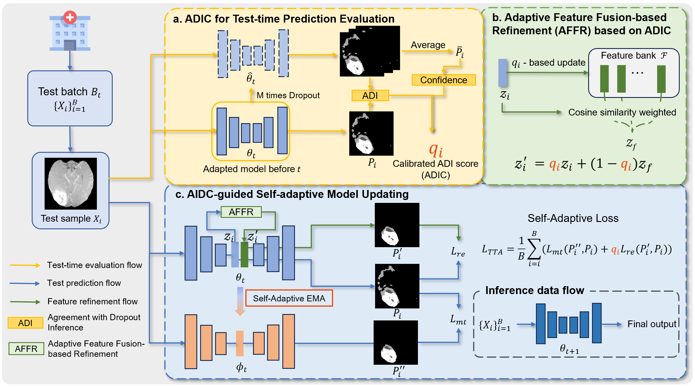

# TEGDA+

This repository provides the code for the extended journal version **TEGDA+: Test-time Evaluation-Guided Dynamic Adaptation for Medical Image Segmentation**.

TEGDA+ extends the original test-time evaluation-guided dynamic adaptation framework with an attention-enhanced feature bank and Fisher-guided selective restoration for more stable online adaptation in medical image segmentation.

## Overall Framework



## Highlights

- **ADIC/AETTA-based quality estimation** evaluates prediction reliability at test time using dropout inference agreement calibrated by confidence.
- **Prototype-pool feature refinement** stores high-confidence target-domain features and fuses them with the current sample through linear attention.
- **Fisher-guided selective restoration** stabilizes adaptation by selectively restoring less important parameters toward the source model.
- **2D and 3D support** is provided for M&Ms and BraTS-style medical image segmentation benchmarks.

## Repository Structure

```text
code/
  dataloaders/                         # BraTS and M&Ms dataloaders
  networks/                            # 2D/3D segmentation networks
  sota/
    tegda_attn.py                      # TEGDA+ 3D test-time adaptation
    tegda_attn_2d.py                   # TEGDA+ 2D test-time adaptation
    aetta.py, aetta2d.py               # TEGDA+ quality estimation modules
  train_fully_supervised_2D.py
  train_fully_supervised_3D.py
  test_time_adaptation_2D_online_eval.py
  test_time_adaptation_3D_online_eval.py
  run_tegda+.sh
data/                                  # CSV splits; place preprocessed data here
pictures/                              # Framework figures
environment.yaml
```

## Dataset

Download BraTS-GLI, BraTS-PED and BraTS-MEN from [BraTS 2023](https://www.synapse.org/#!Synapse:syn51156910/wiki/), and M&Ms from [M&Ms](http://www.ub.edu/mnms).

Preprocessed data can be placed under the corresponding folders in `data/`. The CSV files in this repository provide the expected split format; update paths as needed for your local data root.

## Environment

```bash
conda env create -f environment.yaml
conda activate TTA
```

## Source Model Training

```bash
cd code
python train_fully_supervised_2D.py    # M&Ms
python train_fully_supervised_3D.py    # BraTS
```

## Test-Time Adaptation

Run the journal-version TEGDA+ adaptation examples:

```bash
cd code
bash run_tegda+.sh
```

You can also launch a single experiment manually:

```bash
python test_time_adaptation_3D_online_eval.py \
  --target_domain BraTS_PED \
  --TTA_method tegda_plus \
  --exp BraTs2023_GLI2PED_TEGDAplus

python test_time_adaptation_2D_online_eval.py \
  --target_domain B \
  --TTA_method tegda_plus \
  --exp MMS_A2B_TEGDAplus
```

For compatibility with the implementation filenames, `--TTA_method tegda_attn` is also accepted by the 3D script, and `--TTA_method tegda_attn_2d` is accepted by the 2D script.

## Citation

The journal-version citation will be added after publication.
